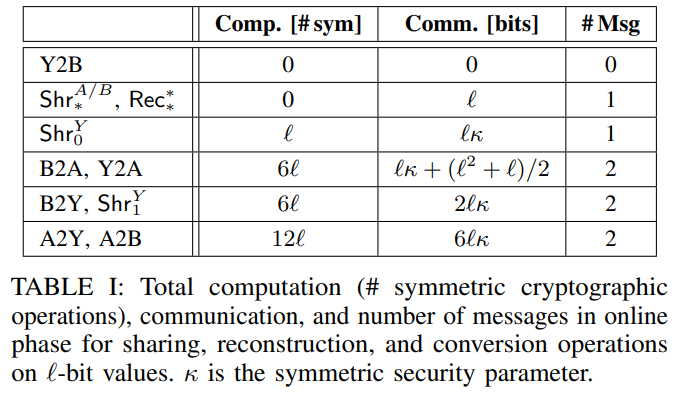
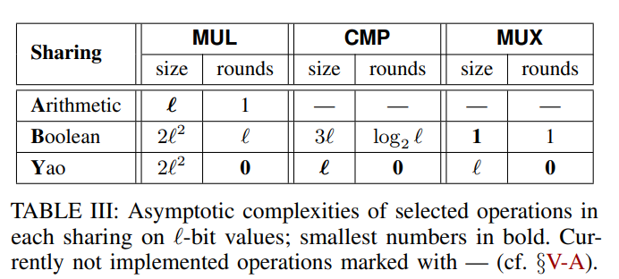
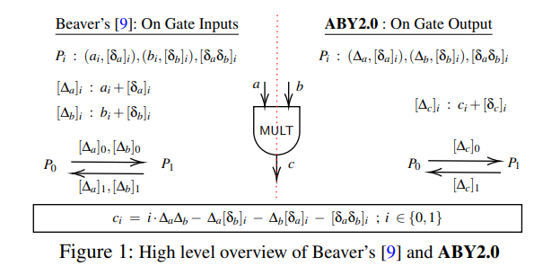
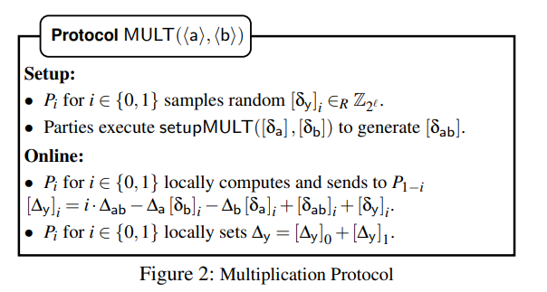
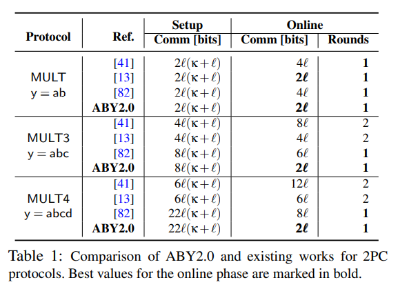
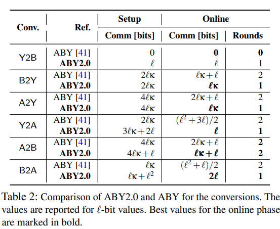
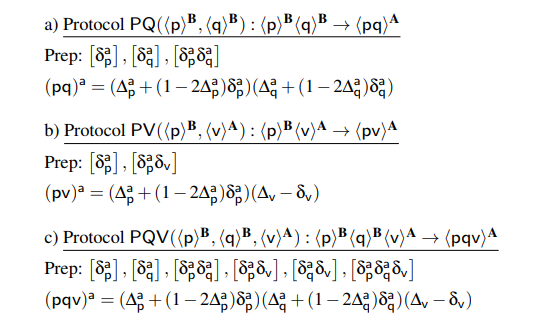
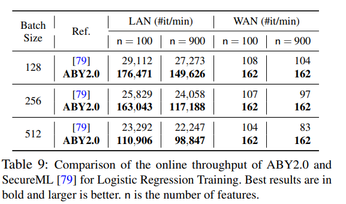
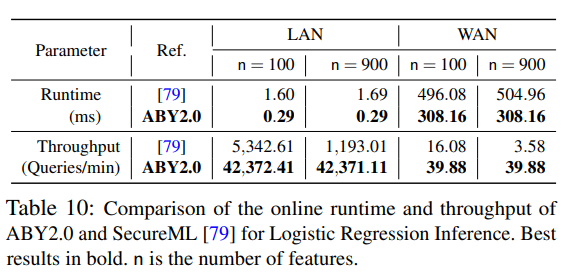
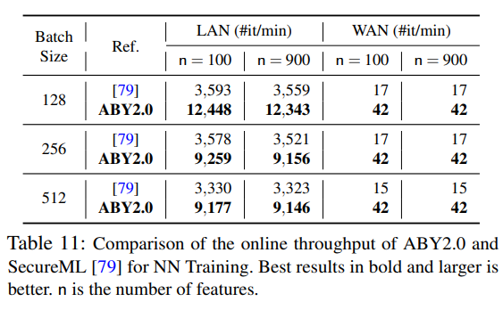

安全多方计算中的算术分享（Arithmetic Sharing）、布尔分享（Boolean Sharing）、和姚氏分享（Yao's Sharing）对于计算不同的算子，例如加法、乘法、比较等各有优势。如何设计更高效的算法、如何平衡不同技术之间的优势侧重从而发挥最好的性能，是一个值得研究的重要问题。

本次我们从ABY和ABY2.0两篇文章，阐述安全两方（$P_0 \& P_1$)计算中三种技术的一些研究进展。文章链接如下：

[ABY](https://thomaschneider.de/papers/DSZ15.pdf)

[ABY2.0](https://eprint.iacr.org/2020/1225)

## ABY:

**Arithmetic Sharing:** ABY中使用Additive Sharing，即对于秘密 $x$ ，生成秘密分享 $\langle x\rangle^A_0 = r \overset{R}{\leftarrow} \mathbb{Z}_{2^\ell}\ \& \ \langle x\rangle^A_1 = x - r$满足$x = \langle x\rangle^A_0 + \langle x\rangle^A_1 \mod{2^\ell}$。并且$P_i$保存 $\langle x\rangle^A_i$。恢复秘密则需要同时获得 $\langle x\rangle^A_0 \& \langle x\rangle^A_1$ 。该分享方法广泛应用于SPDZ等方案。

 **ADD** 对于处于Additive Sharing的值$x\&y$ ，加法可以直接在本地计算，不需要交互。具体来说，则是 $P_i$ 本地计算 $\langle z\rangle^A_i = \langle x\rangle^A_i + \langle y\rangle^A_i \mod{2^\ell}$。

 **MUL:** 但是对于乘法，则需要借助Beaver 三元组 $c=ab$，并且$a,b,c$也是处于Additive Sharing的。在线计算阶段$P_i$ 首先计算 $\langle e\rangle^A_i = \langle x\rangle^A_i - \langle a\rangle^A_i $和$\langle f\rangle^A_i = \langle y\rangle^A_i - \langle b\rangle^A_i$，然后$P_i$之间交换 $\langle e\rangle^A_i \& \langle f\rangle^A_i$ 并恢复 $e\& f$。最后， $P_i$在本地计算$i\cdot e\cdot f + f\cdot \langle a\rangle^A_i + e\cdot \langle b\rangle^A_i + \langle c\rangle^A_i$。
$c=ab$:在MUL中，一个关键点在于计算Beaver三元组$c=ab$。这里介绍ABY中提到的两种方式：基于同态加密（HE-based）的方法和基于茫然传输（OT-based）的方法如下:

  1. *HE-based:* 基于同态的方法简洁明了: $P_i$各自随机选择 $\langle a\rangle^A_i, \langle b\rangle^A_i$。同时, $P_1$选择随机数$r$。之后，$P_0$加密 $\langle a\rangle^A_0, \langle b\rangle^A_0$ 并将密文传输给 $P_1$ 。 $P_1$根据半同态的明文-密文乘法同态性质计算 $d$（用 $r$ 茫化），并将$d$返回给 $P_0$。 $P_0$ 解密 $d$并计算 $\langle c\rangle^A_0$ ， $P_1$ 在本地计算 $\langle c\rangle^A_1$。

  2. *OT-based：*基于OT的方法则略微复杂一些。对于$\langle a\rangle^A \cdot \langle b\rangle^A = \langle c\rangle^A$​ ，有 $\langle a\rangle^A \cdot \langle b\rangle^A = (\langle a\rangle^A_0 + \langle a \rangle^A_1 ) \cdot (\langle b\rangle^A_0 + \langle b\rangle^A_1) = \langle a\rangle^A_0 \cdot \langle b\rangle^A_0 + \langle a\rangle^A_0 \cdot \langle b\rangle^A_1 + \langle a\rangle^A_1 \cdot \langle b\rangle^A_0 + \langle a\rangle^A_1 \cdot \langle b\rangle^A_1$​ 。第一项和第四项都可以在 $P_0$​ 和 $P_1$​ 本地计算，关键在于求交叉项乘法（第2、3项）。接下来说明如何用OT求$\langle u \rangle^A = \langle a\rangle^A_0 \langle b\rangle^A_1$​ ，第3项类似。 具体来说， 在第$i$​次关联OT （C-OT）中, $P_0$​ 作为发送者输入 $f_{\Delta_i}(x)=(\langle a\rangle^A_0 \cdot 2^i -x) \mod{2^\ell}$​ ，而$P_1$​作为接收者输入$\langle b\rangle^A_1[i]$ 作为选择比特。第$i$ 次C-OT执行完毕，$P_0$​ 获得$(s_{i,0}, s_{i,1})$ ，其中 $s_{i,0}\in_R \mathbb{Z}_{2^\ell}$，$s_{i,1}=f_{\Delta_i}(s_{i,0})=(\langle a\rangle^A_0 \cdot 2^i -s_{i,0})\mod{2^\ell}$。而 $P_1$ 则获得 $s_{i,\langle b\rangle^A_1[i]} = (\langle b\rangle^A_1[i]\cdot \langle a\rangle^A_0 \cdot 2^i -s_{i,0})\mod{2^\ell}$。执行完 $\ell$ 次C-OT之后， $P_0$ 令 $\langle u\rangle^A_0 = (\sum_{i=1}^\ell s_{i,0})\mod{2^\ell}$， $P_1$则令 $\langle u\rangle^A_1 = (\sum_{i=1}^\ell s_{i,\langle b\rangle^A_1[i]}) \mod{2^\ell}$。 同理，可以计算 $\langle v\rangle^A = \langle a\rangle^A_1\langle b\rangle^A_0$。最终，$P_i$ 令 $\langle c\rangle^A_i = \langle a\rangle^A_i \langle b\rangle^A_i + \langle u \rangle^A_i + \langle v\rangle^A_i$。

**Boolean Sharing:**和Arithmetic sharing不同的是，Boolean Sharing是操作在比特上的抑或（XOR）秘密分享。也就是说对于一个秘密比特值 $\in \mathbb{Z}_2$，生成一个随机比特 $r\in_R \{0,1\}$ 。然后，令 $\langle x\rangle^B_0 = r, \langle x\rangle^B_1 = x\oplus r$。恢复秘密 $x$ 只需要同时获取 $\langle x\rangle^B_0, \langle x\rangle^B_1$ 并计算 $x= \langle x\rangle^B_0 \oplus \langle x\rangle^B_1$ 即可。对于 $\ell$ 比特的秘密值 $x$，如果要进行Boolean Sharing，只需要对每一比特并行进行Boolean Sharing即可。为了简单起见，这里只讨论 1 比特的 $x$ 。Boolean Sharing主要应用于GMW方案。 

 **XOR:** 类似Arithmetic Sharing中的ADD，XOR在Boolean Sharing也可以无交互计算。即 $P_i$ 在本地计算 $\langle z\rangle^B_i = \langle x\rangle^B_i \oplus \langle y\rangle^B_i$。 

 **AND:** AND门的计算则对应Arithmetic Sharing中的乘法门。因此，也需要预计算一个比特三元组 $\langle c\rangle^B = \langle a\rangle^B  \wedge \langle b\rangle^B$ 来实现 $\langle z\rangle^B = \langle x\rangle^B  \wedge \langle y\rangle^B$。 

 **MUX:** 除了XOR 和 AND 门，Boolean Sharing还适合进行 MUX（选择）门的计算。即 ${\rm MUX}(x,y,b)$: 如果比特 $b=0$ 则返回 $x$ ，否则返回 $y$ 。选择门可以用随机 OT（R-OT）实现。

**Yao Sharing:** 姚氏混乱电路（Yao's Garbled Circuits, Yao's GC）也是一种广泛应用的两方计算协议，其计算在布尔电路上（Boolean Circuits）。和Arithmetic Sharing，Boolean Sharing不同的是，Yao's GC 中计算的双方并不是对称的关系。Garbler（e.g., $P_0$）负责生成整个电路的真值表并将表加密打乱，并将加密打乱的真值表发送给Evaluator（e.g., $P_1$）。 $P_1$ 则负责通过获得对应输入的密钥（a.k.a, label）解密真值表。除了上述基本内容，ABY还使用了free-XOR和point-and-permute等优化技术。使用这些技术， $P_0$ 在生成混乱表的时候可以选择一个全局的 $\kappa$ 比特串 $R$ 满足 $R[0]=1$ 。这样，对于电路中的输入线 $w$，对应的密钥（a.k.a., label）可以设置为 $k_0^w\in_R \{0,1\}^{\kappa}$，$k_1^w=k_0^w\oplus R$。从而，一方面满足XOR门可以非交互计算，另一方面满足 $1-k_0^w[0] = k_1^w[0]$（permutation bit）。对于 $\langle x\rangle^Y$ 则有 $\langle x\rangle^Y_0 = k_0$， $\langle x\rangle^Y_1 = k_x= k_0 \oplus xR$。和Boolean Sharing类似，这里只讨论对于1比特的Yao Sharing。对于 $\ell$ 比特的Yao Sharing，则可以并行进行 $\ell$ 次。 

 **Sharing & Reconstruction** 和Arithmetic/Boolean Sharing不同的是，Yao's GC的Sharing语义对于 $P_0$ 和 $P_1$ 来说并不是等价的。这也是因为 $P_0$ 和 $P_1$ 在GC计算中的角色也不同。具体来说， ${\rm Shr}^Y_0(x)$ 则是 $P_0$ 首先在本地生成 $\langle x\rangle^Y_0 = k_0\in_R \{0,1\}^\kappa$，计算并发送 $k_x = k_0 \oplus xR$ 给 $P_1$ 。而 ${\rm Shr}_1^Y(x)$ 则是双方进行C-OT，其中 $P_0$ 输入关联函数 $f_R(x)=(x\oplus R)$ 并获得 $k_0, k_1 = k_0\oplus R$ 其中 $k_0 \in_R \{0,1\}^\kappa$， $P_1$ 作为接收者输入选择比特 $x$ 并获得 $\langle x\rangle^Y_1 = k_x$。恢复秘密则需要 $P_{1-i}$ 将 $\pi = \langle x\rangle^Y_{1-i}[0]$ 发送给 $P_i$， $P_i$ 计算 $x=\pi \oplus \langle x\rangle^Y_i[0]$。 

 **XOR:** 利用free-XOR技术，XOR门也可以在本地计算 $\langle z\rangle^Y_i = \langle x\rangle^Y_i \oplus \langle y\rangle^Y_i$。 

 **AND:** 对于AND门，$P_0$ 利用 $\langle x\rangle^Y_0, \langle y\rangle^Y_0$ 加密 $\langle z\rangle^Y_0$ 得到混乱表 ${\rm Gb}_{\langle z\rangle^Y_0}(\langle x\rangle^Y_0, \langle y\rangle^Y_0)$。 $P_1$ 获得混乱表之后便利用 $\langle x\rangle^Y_1,\langle y\rangle^Y_1$ 解密表中的对应项。

**Sharing Conversion:** 上述三种Sharing各有自己的优势和劣势。在实际应用中往往要结合三种技术，充分发挥各自的性能。接下来介绍三种Sharing之间的转化。

  **Yao to Boolean Sharing (Y2B):**  因为Yao Sharing （ $\langle x\rangle^Y_0, \langle x\rangle^Y_1$）的permutation bits 已经构成了关于 $x$ 的Boolean Sharing，所以 $P_i$ 可以在本地令 $\langle x\rangle^B_i = Y2B(\langle x\rangle^Y_i)= \langle x\rangle^Y_i[0]$。

  **Boolean to Yao Sharing (B2Y):** 将 $\langle x\rangle^B$ 转化为 $\langle x\rangle^Y$ 和 ${\rm Shr}^Y_1$ 很相似。记 $x_0 = \langle x \rangle^B_0$, $x_1 = \langle x\rangle^B_1$。$P_0$ 取 $\langle x\rangle^Y_0 = k_0 \in_R\{0,1\}^\kappa$。两方随后执行OT， $P_0$ 作为发送者输入 $(k_0 \oplus x_0\cdot R, k_0 \oplus (1-x_0)\cdot R)$， $P_1$ 作为接收者输入 $x_1$ 作为选择比特获得 $\langle x\rangle^Y_1 = k_0 \oplus (x_0\oplus x_1)\cdot R = k_x$。

  **Arithmetic to Yao Sharing (A2Y):** 将 $\langle x\rangle^A$ 转化为 $\langle x\rangle^Y$ 则是两方执行 ${\rm Shr}^Y_0(\langle x\rangle^A_0)$ 和 ${\rm Shr}^Y_1(\langle x\rangle^A_1)$ 得到 $\langle \langle x\rangle^A_0\rangle^Y$ 和 $\langle \langle x\rangle^A_1\rangle^Y$ ，最终在在Yao Sharing下计算加法电路 $\langle x\rangle^Y= \langle \langle x\rangle^A_0\rangle^Y + \langle \langle x\rangle^A_1\rangle^Y$。

  **Arithmetic to Boolean Sharing (A2B):** A2B可以用Boolean加法电路实现（和A2Y）类似，或者使用Arithmetic 比特抽取电路。由于在Y2B是没有开销（free），而Yao Sharing在做加法时比Boolean电路更加高效，因此使用 $Y2B(A2Y(\langle x\rangle^A))$ 实现 $A2B(\langle x\rangle^A)$。

  **Boolean to Arithemtic Sharing (B2A):** B2A可以通过Boolean 电路上的减法实现，但是这种方法开销太大。为了提升性能，两方可以使用基于OT的方法实现，该方法和生成三元组的方法类似。在第 $i$ 次OT，$P_0$ 作为发送方输入 $(s_{i,0}, s_{i,1})$ 满足 $s_{i,0}=\langle x\rangle_0^B[0]\cdot 2^i -r_i$， $s_{i,1}= (1-\langle x\rangle^B_0[i])\cdot 2^i -r_i。 $P_1$ 作为接受方输入 $\langle x\rangle^B_1[i]$ 作为选择比特得到 $s_{\langle x\rangle^B_1[i]} = (\langle x\rangle^B_0[i]\oplus \langle x\rangle^B_1[i])\cdot 2^i - r_i$。最终， $P_0$ 计算得到 $\langle x\rangle^A_0 = \sum_{i=0}^{\ell-1} r_i$， $P_1$ 计算 $\langle x\rangle^A_1 = \sum_{i=0}^{\ell-1} s_{\langle x\rangle^B_1[i]}=\sum_{i=0}^{\ell-1} (\langle x\rangle^B_0[i]\oplus \langle x\rangle^B_1[i])\cdot 2^i - \sum_{i=0}^{\ell-1}r_i = x - \langle x\rangle^A_0$。从而完成B2A转换。

  **Yao to Arithmetic Sharing (Y2A):** 从Yao share转化到 Arithmetic share可以有两种方法进行： 1） $P_0$ 随机选择 $r\in_R \mathbb{Z}_{2^\ell}$ 并执行 ${\rm Shr}^Y_0(r)$ 。进一步，两方计算 $\langle d\rangle^Y = \langle x\rangle^Y-\langle r\rangle^Y$ 并揭示 $d$ 给 $P_1$ 。最终， $\langle x\rangle^A_0=r$， $\langle x\rangle^A_1 = d$。但这种方法需要在Yao Sharing下执行Boolean 减法电路。 2）由于 $Y2B$ 没有开销，而 $B2A$ 比Yao Sharing下的Boolean 减法电路更加高效，因此可以利用 $B2A(Y2B(\langle x\rangle^Y))$ 实现 $Y2A(\langle x\rangle^Y)$。

**理论开销：**上述分享和转化理论开销如下表所示。

三种最重要的计算理论开销如下：

其他相关的分析和实验细节请参考原文。

## ABY2.0

接下来介绍ABY2.0，在这里着重分析ABY2.0对ABY的提升和不同。

**Arithmetic Sharing:**

  **Sharing Semantics:** 和ABY相比，ABY2.0使用两种sharing。 1. 是additive sharing，记作 $[\cdot]\text{-sharing}$ ，即对于秘密值 $v$ 有 $[v]_0 + [v]_1 = v$， $P_i$ 持有 $v_i$；2. 是 $\langle \cdot\rangle\text{-sharing}$，即对于 $v:1）公布 $\Delta_v = v+\delta_v$，2） $\delta_v$ 在 $P_0，P_1$ 之间 $[\cdot]\text{-sharing}$。 简单起见， $\delta_{v_1...v_n}$ 表示乘积 $\delta_{v_1}\delta_{v_2}...\delta_{v_n}$ ， $\Delta_{v_1...v_n}$ 表示乘积 $\Delta_{v_1}\Delta_{v_2}...\Delta_{v_n}$。 

  **SHARE:** 在预计算阶段， $P_i$ 生成 $[\delta_v]_i$ ，两方共同选择 $[\delta_v]_{1-i}$。因此，$P_i$ 得到 $\delta_v = [\delta_v]_0 + [\delta_v]_1$ 。在线计算阶段， $P_i$计算并公开 $\Delta_v = v + \delta_v$。

  **Reconstruction:** 恢复 $v$则只需恢复 $\delta_v$ 然后计算 $\Delta_v - \delta_v$。 

  **Linear Operations:** 给定 $\langle a\rangle, \langle b\rangle$ 和公开数值 $c_1,c_2$，为了计算 $\langle y\rangle = c_1\cdot \langle a\rangle + c_2 \cdot \langle b\rangle$ ， $P_i$ 在本地计算 $\Delta_y = c_1 \cdot \Delta_a + c_2 \cdot \Delta_b$ 和 $[\delta_y]_i = c_1 \cdot [\delta_a]_i + c_2 \cdot [\delta_b]_i$。 

  **Multiplication:** 和ABY相比，ABY2.0最大的不同在于对乘法的改进。对于 $a\cdot b$ ，有 $y=a\cdot b = ((a+\delta_a)-\delta_a)((b+delta_b)-\delta_b)= (a+\delta_a)(b+\delta_b)- (a+\delta_a)\delta_b-(b+\delta_b)\delta_a + \delta_{ab}$ 。ABY中使用Beaver三元组的方法茫化输入，但是ABY2.0的分享语义下， $a+\delta_a$ 和 $b+\delta_b$ 在分享阶段就已经公开。如果三元组能够预计算生成，那么在线计算可以不用通信开销。但是为了输入输出的分享语义一致性，还需要公开 $\Delta_y$。但这仅需要每方传输一个数。通信量减少了两倍。

  形式化，$\Delta_y = y + \delta_y = ab + \delta_y = (\Delta_a-\delta_a)(\Delta_b-\delta_b)+\delta_y = \Delta_a\Delta_b -\Delta_a\delta_b - \Delta_b \delta_a + \delta_a\delta_b + \delta_y$。协议如下：

  而预计算阶段生成三元组 $([\delta_a], [\delta_b], [\delta_{ab}])$ 的方法和ABY一样。 

  **Multi-Input Multiplication:** 对比ABY，另一个提升在于多输入乘法只需要一轮通信而且通信量只有 $\ell$ 比特。以3-input为例， $\Delta_y = abc + \delta_y= (\Delta_a-\delta_a)(\Delta_b-\delta_b)(\Delta_c-\delta_c)+ \delta_y = \Delta_{abc}-\Delta_{ab}\delta_c-\Delta_{bc}\delta_a - \Delta_{ac}\delta_b + \Delta_a \delta_{bc} + \Delta_b \delta_{ac}+ \Delta_c\delta_{ab} - \delta_{abc}+ \delta_y$。预计算生成 $\delta_{ab}, \delta_{bc}, \delta_{ac}, \delta_{abc}$ ，则在线计算可以一次通信完成。 对于N-input乘法，则需要生成 $2^N-N-1$ 个元组交叉项，因此为了平衡在线和预计算开销，ABY2.0取 $N\in\{3,4\}$ 。下图展示ABY2.0在乘法计算的优化提升

**Boolean Sharing:** Boolean Sharing和Arithmetic Sharing类似，区别在于操作的电路是布尔电路，可以看作在 $\mathbb{Z}_2$ 上的Arithemtic Sharing。 另一个不同点在于Negation的实现：对于 $\langle u\rangle^B= ([\delta_u], \Delta_u)$，为了生成 $\langle \bar{u}\rangle^B$ 计算 $\Delta_{\bar{u}}= 1\oplus \Delta_u$， $[\delta_{\bar{u}}]= [\delta_u]$。

**Yao Sharing** ABY2.0和ABY采用了同样的Yao Sharing。

**Sharing Conversion** ABY转化中在线阶段需要大量OT，ABY2.0中OT都在预计算完成，因此ABY2.0转化中在线效率提升很多（除了Y2B）。

  **Y2B:** 和ABY一样，Y2B是没有开销的。但为了保持Boolean Sharing语义一致性，需要额外一轮通信揭示 $\Delta$ 。进一步， $P_0$ 可以在预计算阶段计算 ${\rm SHARE}^B(P_0, {\rm LSB}(K_u^0))$。

  **B2Y:** $P_i$ 在本地计算 $u_i = (1-i)\cdot \Delta_u \oplus [\delta_u]_i$。随后分别计算 ${\rm SHARE}^Y(P_i, u_i)$ 得到 $\langle u_0\rangle^Y$ 和 $\langle u_1\rangle^Y$。最后，利用free-XOR技术计算 $\langle u\rangle^Y = \langle u_0\rangle^Y \oplus \langle u_1\rangle^Y$。注意的是， $u_1$ 在预计算阶段已经确定，因此可以将 OT（用来执行 ${\rm SHARE}^Y(P_1, u_1)$）转移到预计算阶段。

  **A2Y:** 和B2Y类似，不同之处在于需要用Yao GC执行一个加法电路。 

  **Y2A:** ABY2.0采用的方法类似ABY中提到的Y2A方法 1）。预计算阶段生成 $r$，并对 $r$ 进行 ${\rm SHARE}^Y(P_0,r)$ 和 ${\rm SHARE}^A(P_0,r)$ 。在线阶段在Yao GC下计算加法电路得到 $\langle v+r\rangle^Y$ 并公开 $v+r$。随后计算 ${\rm SHARE}^A(P_0, v+r)$ 得到 $\langle v+r\rangle^A$ 。最后，计算得到 $\langle v\rangle^A = \langle v+r\rangle^A - \langle r\rangle^A$。 

  **A2B:** 类似A2Y执行一个Boolean加法电路。另外一种常数轮通信的方法则是利用 $Y2B(A2Y(\langle v\rangle^A))$。 

  **Bit2A：**也是一个经常应用的基本技术。对于 $v\in \{0,1\}$ ， $v=v_0\oplus v_1$ ，有 $v^a = v_0^a + v_1^a - 2v_0^av_1^a$ ，其中 $v^a$  表示 $v$ 的 $\ell$ 比特表示。所以 $v^a = (\Delta_v \oplus \delta_v)^a = \Delta_v^a + \delta_v^a - 2\Delta_v^a\delta_v^a$ 。 假设预计算得到了 $\delta_v^a$ 的 $[\cdot]\text{-shares}$，在线阶段 $P_i$ 在本地计算 $[\delta^a]_i = i\cdot \Delta_v^a + (1-2\Delta_v^a)\cdot [\delta_v^a]_i$。最后计算 ${\rm SAHRE}^A(P_i, [v^a]_i)$ 得到 $\langle [v^a]_i\rangle^A$ 最终计算 $\langle v^a\rangle^A = \langle [v^a]_0\rangle^A + \langle [v^a]_1\rangle^A$。 最后，基于 $\delta_v = [\delta_v]_0\oplus [\delta_v]_1 \Leftrightarrow \delta_v^a = [\delta^a_v]_0 + [\delta^a_v]_1 - 2([\delta^a_v]_0[\delta^a_v]_1)$，可以用C-OT实现交叉项的计算（和ABY中计算Beaver三元组类似）。 

  **B2A：**和ABY类似，基于 $v = \sum_{j=0}^{\ell-1}2^j \cdot v[j]$ 对每一比特调用一次Bit2A。这样通过一轮通信并行完成每一比特的转化。然后对于 $[\cdot]\text{-sharing}$ 的每一比特做求和。最后对求和结果进行 ${\rm SHARE}^A$。下图展示不同conversion的理论开销。

  **Special Conversions:** ABY2.0基于Bit2A做了三种比较高效转化如下（PQ, PV, PQV），比较直观不做过多介绍。

**面向机器学习的模块构造：**除了上述基本模块，ABY2.0还构造了如下面向ML的模块。简单介绍一下。

  **Scalar Product:** 向量内积借鉴了先相加再分享的方法，结合ABY2.0的乘法，将在线通信降低为2个环元素。 

  **Matrix Multiplication:** 类似向量内积的计算，将在线通信从 $O(pqr)$ 降低为 $O(pr)$ 。其中， $p\times q, q\times r$ 分别为两个矩阵的大小。

  **Depth-Optimized Circuits:** 通过Parallel-Prefix Adders (PPA)优化布尔加法电路深度，在64比特环上降低了2倍深度。从而构造BitExt更高效提取 ${\rm MSB}(v)$。 

  **Comparsion(LT):** 定点数计算 $x<y$ 等价于 $v=x-y$ 的最高有效位。计算得到 $\langle v\rangle = \langle x\rangle -\langle y\rangle$ 之后，令 $a = -[\delta_v]_0$， $b = \Delta_v - [\delta_v]_1$。进一步， $P_0, P_1$ 计算 ${\rm SHARE}^B(P_0, a), {\rm SHARE}^B(P_1, b)$ 得到Boolean sharing。最后利用BitExt提取 ${\rm MSB}(v)$ 。

  **Truncation:** 乘法截断可以防止溢出。ABY2.0采用了SecureML中的方法，在算完 $ab$ 之后做截断，然后计算公开 $\Delta$。

  **MAX2/MIN2:**  ${\rm MAX2}(\langle a\rangle^A, \langle b\rangle^A)$ 计算如下，首先计算 $\langle u\rangle^B = \langle a<b\rangle^B$ 。然后利用PV协议计算 $u\cdot(b-a) + a$。 ${\rm MIN2}(\langle a\rangle^A, \langle b\rangle^A)$ 类似。

  **MAX3/MIN3:** ${\rm MAX3}(\langle a\rangle^A, \langle b\rangle^A, \langle c\rangle^A)$ 计算如下，首先计算 $\langle u_1\rangle^B = \langle a<b\rangle^B, \langle u_2\rangle^B = \langle a<c\rangle^B, \langle u_3\rangle^B = \langle b<c\rangle^B$ 。最后利用PQV计算 $y = \bar{u_1}\cdot \bar{u_2}\cdot a + u_1 \cdot \bar{u_3}\cdot b + u_2\cdot u_3\cdot c$。MIN3类似。

  **ReLU & Sigmoid:** ${\rm ReLU}(v)=max(0,v)$​，首先计算 $\langle u\rangle^B$​ 满足 $u=1 \Leftrightarrow v <0$​ 。进一步计算 $\langle \bar{u}\rangle^B$​。最后利用PV协议计算 $\langle \bar{u}\rangle^B \cdot \langle v\rangle^A$​。 对于${\rm Sigmoid}$​利用如下分段函数近似 
  $${\rm Sig}(v)=\begin{cases} 0, & v < -\frac{1}{2}\\ v + \frac{1}{2}, & -\frac{1}{2}\le v \le \frac{1}{2}\\ 1, & v > \frac{1}{2} \end{cases}$$​。 形式化 ${\rm Sig}(v)=\bar{u_1}\cdot u_2 (v+1/2)+ \bar{u_2}$​，其中 $u_1=1\Leftrightarrow v + 1/2 < 0$​ 且 $u_2 = 1\Leftrightarrow v-1/2 < 0$​ 。具体来说，对 $v+1/2, v-1/2$​ 分别执行 LT 协议得到 $\langle u_1\rangle^B, \langle u_2\rangle^B$​。最后执行PQV协议得到结果。 

  **Maxpool/Minpool：**依赖于MAX/MIN 协议。 

  **Equality Testing:**  在ABY2.0的分享语义下， $x=y \Leftrightarrow \Delta_x - [\delta_x]_0- [\delta_x]_1 = \Delta_y - [\delta_y]_0- [\delta_y]_1$。令 $v_0 = (\Delta_x - [\delta_x]_0) - (\Delta_y-[\delta_y]_0)$。所以问题归结为判断 $v_0 \overset{?}{=}v_1$。 $v_i$ 可以由 $P_i$ 本地计算得到，进一步执行 ${\rm SHARE}^B(v_i)$ 得到 $\langle v_i\rangle^B$。然后计算 $\langle v\rangle^B = {\rm NOT}(\langle v_0\rangle^B \oplus \langle v_1\rangle^B)$。最终，验证 $v$ 是否所有比特均为1。对此，执行AND4门，最终计算一个AND2门。

**实验:** ABY2.0做了许多实验，这里仅展示关于PPML部分关于模型训练和预测的结果。

**总结**

和ABY相比，ABY2.0对于电路性能进行了进一步的提升，大部分开销转移到了预计算阶段。这主要归功于新的sharing semantics的提出。但是，预计算的开销却增加到了指数级别（多输入乘法门）。进一步，ABY2.0的计算需要对事先对电路的结构进行全局的扫描生成乘法关联元组，这比ABY的要求更加严格。